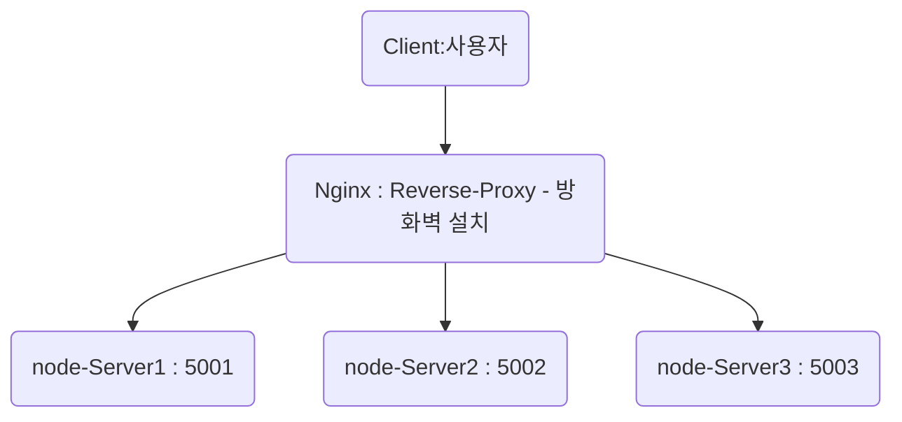

# Nginx + NodeJs + Docker 

## Proxy Server

프록시 서버(영어: proxy server 프록시 서버[*])는 클라이언트가 자신을 통해서 다른 네트워크 서비스에 간접적으로 접속할 수 있게 해 주는 컴퓨터 시스템이나 응용 프로그램을 가리킨다
ref : https://ko.wikipedia.org/wiki/%ED%94%84%EB%A1%9D%EC%8B%9C_%EC%84%9C%EB%B2%84


+ flow

****
+ **docker 에서 방화벽 관련한 이슈가 있다.**
+ docker로 컨테이너를 띄우고나서 Ubuntu의 ufw를 사용하여 방화벽을 걸었을 경우 아래의 옵션이 추가되지 않으면 ufw에서 세팅한 방화벽 정책이 활성화되지 않는다.
+ ref : https://wiki.arone.co.kr/pages/viewpage.action?pageId=8421495
  
```js
const http = require('http');

const Server = function(port, msg){
    this.port = port;
    this.message = msg;
    this.context =`server is listening on http://localhost:${port}`;
}

Server.prototype.on = function(){
    const msg = this.message;
    const server = http.createServer(function (req, res) {  
        res.writeHead(200, {'Content-Type' : 'text/plain'});
        res.write(msg);
        res.end();
    })
    console.log(this.context);
    return server.listen(this.port);
}

new Server(5001, `hello nodejs server 1`).on();
new Server(5002, `hello nodejs server 2`).on();
new Server(5003, `hello nodejs server 3`).on();
```

+ Dockerfile
```yml
FROM node:8
COPY . .
RUN npm install
EXPOSE 5001 5002 5003
WORKDIR /
 
CMD node app.js;
```

+ nginx.conf

```js
user  nginx;
worker_processes  1;
error_log  /var/log/nginx/error.log warn;
pid        /var/run/nginx.pid;
events {                     
    worker_connections  1024;
}
http {
    include       /etc/nginx/mime.types;
    default_type  application/octet-stream;
    upstream docker-nginx {
        server nodeapp:5001 weight=10 max_fails=3 fail_timeout=10s;
        server nodeapp:5002 weight=10 max_fails=3 fail_timeout=10s; 
        server nodeapp:5003 weight=10 max_fails=3 fail_timeout=10s;
    }
    server {
        listen 80;
        server_name localhost;
        location / {
            proxy_pass         http://docker-nginx;
            proxy_redirect     off;
            proxy_set_header   Host $host;
            proxy_set_header   X-Real-IP $remote_addr;
            proxy_set_header   X-Forwarded-For $proxy_add_x_forwarded_for;          
        }
    }
    
    log_format  main  '$remote_addr - $remote_user [$time_local] "$request" '
                      '$status $body_bytes_sent "$http_referer" '
                      '"$http_user_agent" "$http_x_forwarded_for"';
    access_log  /var/log/nginx/access.log  main;
                                                
    sendfile        on;                                                                         
    keepalive_timeout  65;                                                                      
    include /etc/nginx/conf.d/*.conf;     
}
```

```
 server nodeapp:5001 weight=10 max_fails=3 fail_timeout=10s;
```
|옵션|	설명|
|--|---|
|p_hash	|같은 방문자로부터 도착한 요청은 항상 같은 업스트림 서버가 처리 할 수 있게 한다.
weight=n|업스트림 서버의 비중을 나타낸다. 이 값을 2로 설정하면 그렇지 않은 서버에 비해 두배 더 자주 선택된다.
max_fails=n|	n으로 지정한 횟수만큼 실패가 일어나면 서버가 죽은 것으로 간주한다.
fail_timeout=n|	max_fails가 지정된 상태에서 이 값이 설정만큼 서버가 응답하지 않으면 죽은 것으로 간주한다.
down	|해당 서버를 사용하지 않게 지정한다. `ip_hash;` 지시어가 설정된 상태에서만 유효하다.
backup	|모든 서버가 동작하지 않을 때 backup으로 표시된 서버가 사용되고 그 전까지는 사용되지 않는다.

---

+ docker-compose.yml
  
```yml
version: "3.7"
services:
   nodeapp:
     build : .
     container_name: nodejs_testapp
   nginx:
     image: nginx:alpine
     container_name: nginx_test
     restart: unless-stopped
     ports:
       - "80:80"
     volumes:
       - ./vol/nginx/nginx.conf:/etc/nginx/nginx.conf # nginx 설정 파일 volume 맵핑
```

+ run 

```git
docker-compose up -d
```

## Proxy Server 

+ 참고 자료
+ 출처 : ref : https://www.lesstif.com/system-admin/forward-proxy-reverse-proxy-21430345.html

  
### Forward Proxy


클라이언트가  example.com 에 연결하려고 하면 사용자 PC 가 직접 연결하는게 아니라 포워드 프록시 서버가 요청을 받아서  example.com 에 연결하여 그 결과를 클라이언트에 전달(forward) 해 준다.

포워드 프록시는 대개 캐슁 기능이 있으므로 자주 사용되는 컨텐츠라면 월등한 성능 향상을 가져올 수 있으며 정해진 사이트만 연결하게 설정하는 등 웹 사용 환경을 제한할수 있으므로 기업 환경등에서 많이 사용한다.

### Reverse Proxy


클라이언트가 example.com 웹 서비스에 데이타를 요청하면 Reverse Proxy는 이 요청을 받아서 내부 서버에서 데이타를 받은후에 이 데이타를 클라이언트에 전달하게 된다.
내부 서버가 직접 서비스를 제공해도 되지만 이렇게 구성하는 이유중 하나는 보안때문이다.

보통 기업의 네트워크 환경은 DMZ 라고 하는 내부 네트워크와 외부 네트워크 사이에 위치하는 구간이 존재하며 이 구간에는 메일 서버, 웹 서버, FTP 서버등 외부 서비스를 제공하는 서버가 위치하게 된다.

example.com 사는 서비스를 자바로 구현해서 WAS 를 DMZ 에 놓고 서비스해도 되지만 WAS 는 보통 DB 서버와 연결되므로 WAS 가 최전방에 있으면 WAS 가 털릴 경우 DB 서버까지 같이 털리는 심각한 문제가 발생할 수 있다.

이때문에 리버스 프락시 서버를 두고 실제 서비스 서버는 내부망에 위치시키고 프락시 서버만 내부에 있는 서비스 서버와 통신해서 결과를 클라이언트에게 제공하는 방식으로 서비스를 하게 된다.

특히 리눅스 환경이라면 리버스 프락시로 아파치 웹 서버를 사용한다면 SELinux 를 켜 놓으면 SELinux 의 기본 정책이 웹 서버는 톰캣의 8080, 8009 포트만 접근 할 수 있으므로 아파치 웹 서버가 해킹당해도 웹 서버 권한으로는 내부망으로 연결이 불가하다.

또한 리버시 프락시를 cluster로 구성해 놓으면 가용성을 높일 수 있고 사용자가 증가하는 상황에 맞게 Web Server 나 WAS 를 유연하게 늘릴 수 있는 장점이 있다.


